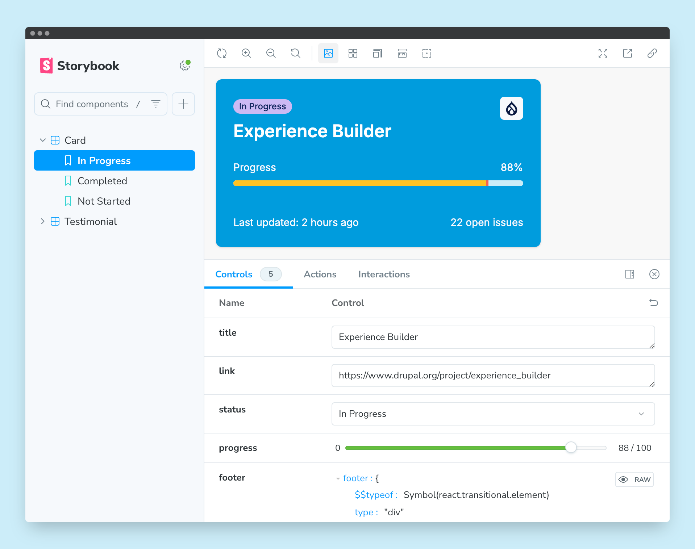

# `canvas-cc-starter`

```
┌─────────────────────────────────────┐
│                                     │
│   * Steepbase *                     │
│   Tools steeped for Drupal Canvas   │
│                                     │
└─────────────────────────────────────┘
```

Build and test
[Drupal Canvas Code Components](https://project.pages.drupalcode.org/canvas/code-components)
with this preconfigured development environment.



[Drupal Canvas](https://www.drupal.org/project/canvas) has an in-browser code
editor for authoring components using React/Preact and Tailwind CSS. Compiling
these components happens directly in the browser, and they instantly become
available to content creators.

The components can also be developed outside of Drupal Canvas, and synchronized
using [`@drupal-canvas/cli`](https://www.npmjs.com/package/@drupal-canvas/cli).

This starter project aims to provide a development environment. It loosely
mimics how Drupal Canvas compiles JavaScript and builds the CSS code by using
[SWC](https://swc.rs) and [Tailwind CSS v4](https://tailwindcss.com).

## Features

- [Storybook](https://storybook.js.org) for developing and presenting the
  components
  - [Viewports](https://storybook.js.org/docs/essentials/viewport) configured to
    match the viewport sizes Drupal Canvas uses
- Compiling with [SWC](https://swc.rs) (Drupal Canvas uses
  [`@swc/wasm-web`](https://swc.rs/docs/usage/wasm)) through
  [`@vitejs/plugin-react-swc`](https://www.npmjs.com/package/@vitejs/plugin-react-swc)
- [Tailwind CSS v4](https://tailwindcss.com) for styling
  - [Inter font](https://rsms.me/inter) added as an example
- [Prettier](https://prettier.io/) with plugins configured
  - [`prettier-plugin-tailwindcss`](https://www.npmjs.com/package/prettier-plugin-tailwindcss)
  - [`@ianvs/prettier-plugin-sort-imports`](https://www.npmjs.com/package/@ianvs/prettier-plugin-sort-imports)
- [ESLint](https://eslint.org/) config started from that of
  [`create-vite`](https://www.npmjs.com/package/create-vite) for its
  [`react` template](https://github.com/vitejs/vite/blob/main/packages/create-vite/template-react/eslint.config.js),
  extended specifically for Drupal Canvas:
  - Disallows named exports and requires default exports in components, which is
    a requirement in Drupal Canvas
  - Disables the error for missing prop validation, which might be better suited
    for the intended target audience of Drupal Canvas Code Components
- Pre-commit hook with [Husky](https://typicode.github.io/husky) for linting and
  formatting staged files using
  [`lint-staged`](https://www.npmjs.com/package/lint-staged)
- [GitHub Actions](https://github.com/features/actions) workflows:
  - Static code checks
  - Validating PR titles against
    [the Conventional Commits specification](https://www.conventionalcommits.org/en/v1.0.0)
    (delete `.github/workflows/lint-pr.yml` if you don't want this)
- Sample components

## Commands

| Command               | Description                           |
| --------------------- | ------------------------------------- |
| `dev`                 | Starts Storybook's development server |
| `storybook`           | Alias for `dev` command               |
| `build-storybook`     | Creates a static Storybook build      |
| `code:check`          | Runs all code checks                  |
| `code:check:prettier` | Checks code formatting with Prettier  |
| `code:check:eslint`   | Checks code with ESLint               |
| `code:fix`            | Runs all code fixes                   |
| `code:fix:prettier`   | Fixes code formatting with Prettier   |
| `code:fix:eslint`     | Fixes code with ESLint                |
